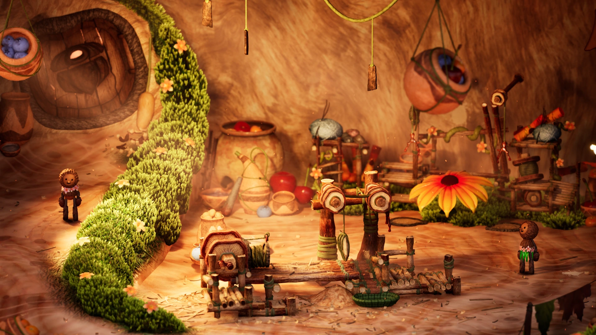
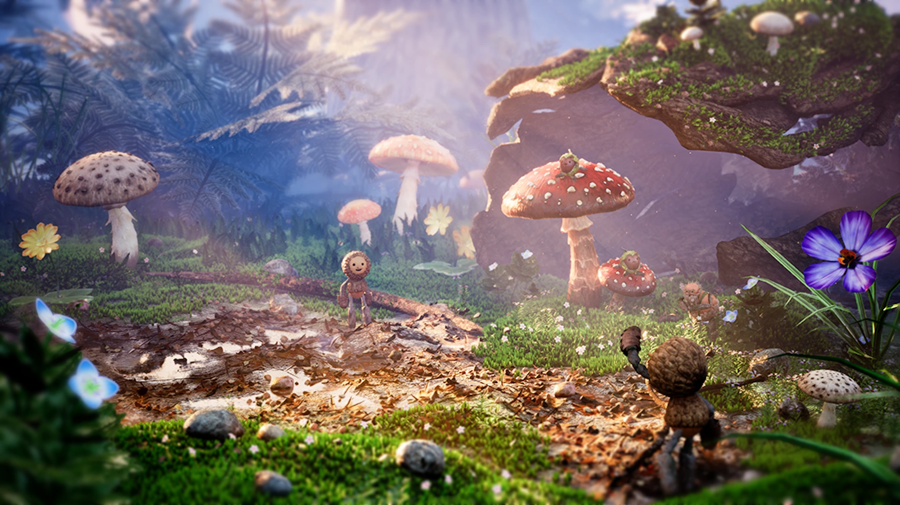
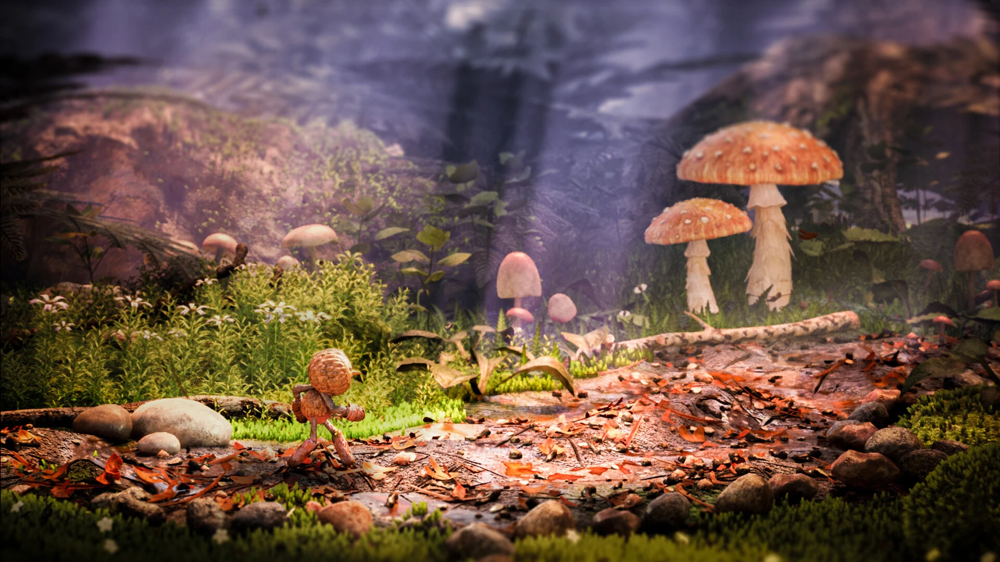
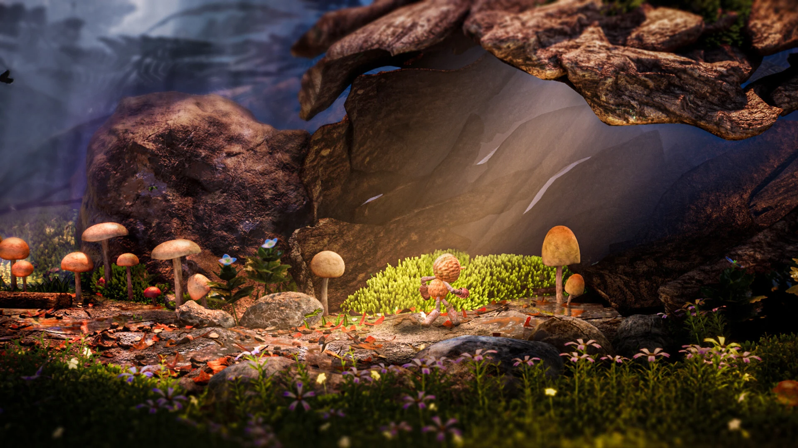
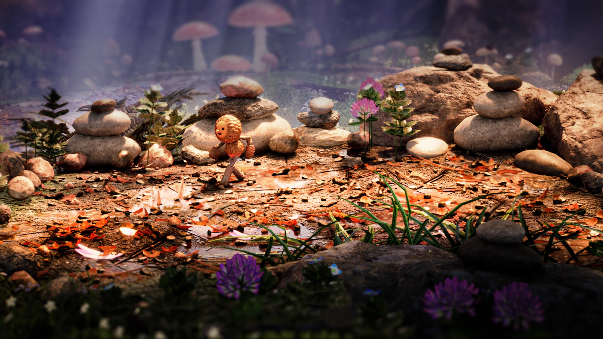
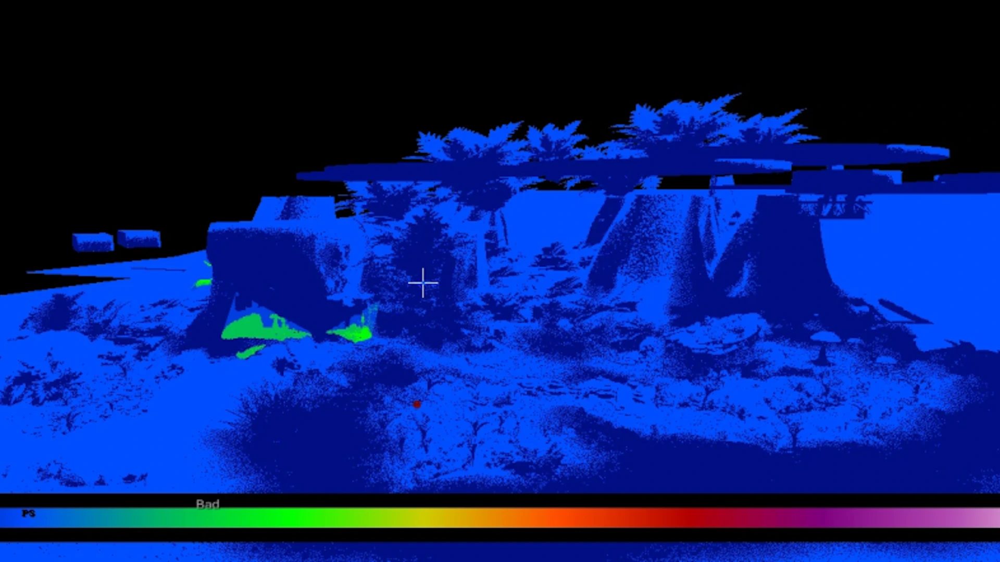
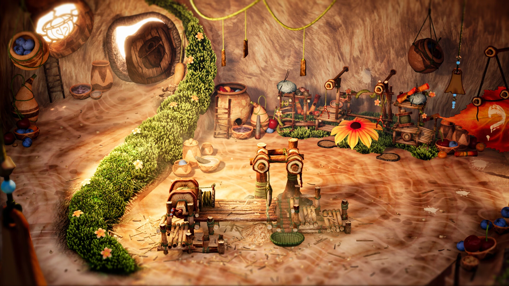
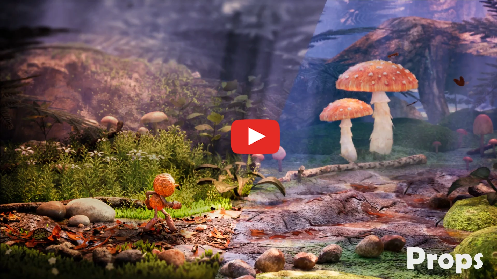

# Oakfolks

   

A cooperative crafting and assembly game developed in Unreal Engine 5 where two players embody small forest creatures working together to fulfill construction orders for their Oakfolks community using machines and tools that require mandatory collaboration.

## Table of Contents

- [Project Pitch](#project-pitch)
- [Key Features](#key-features)
- [Controls](#controls)
- [Team Credits](#team-credits)
- [Core Systems](#core-systems)
- [Artistic Universe](#artistic-universe)
- [Installation & Setup](#installation--setup)
- [Core Design Pillars](#core-design-pillars)
- [Version History](#version-history)
- [Technical Specifications](#technical-specifications)
- [References & Inspiration](#references--inspiration)

## Project Pitch

**Oakfolks** (development codename: "Becorn") is a cooperative game where the objective is to create constructions for the Oakfolks community using machines and tools that must be operated by two players working together. Set in a miniature forest world inspired by photographer [David M. Bird's "Becorn"](https://www.davidmbird.com) creatures, players take control of small plant-based beings living in harmony with nature.

The game is designed so that cooperation is mandatory - it is technically impossible to play solo, forcing constant synchronization between players.

**Core Gameplay Loop:**
1. Discover gameplay mechanics and explore the environment
2. Explore and gather resources, operate machinery collaboratively through QTE mini-games
3. Craft and assemble items using the recipe-based furniture assembly system
4. Validate completed orders by delivering crafted items to delivery points

## Key Features

- **Mandatory Cooperative Gameplay**: Requires constant player synchronization
- **QTE System**: Event-driven Quick Time Events with real-time progress feedback and visual effects
- **Recipe-Based Crafting System**: `FurnitureAssembler` with DataTable-driven recipes and delivery points
- **TriggerZone System**: Zone-based interaction detection triggering contextual events (dialogues, UI, VFX)
- **Rope Physics System**: Rope interaction mechanics with physics and specialized animations
- **Camera System**: Dynamic tilt-shift effects with player distance-based framing constraints
- **High Five Gestures**: Player communication through gestural mechanics
- **Interactive Environment**: HDR lighting, firefly effects, interactive foliage, and physics-based objects
- **Machine Operations**: Wood cutting, mushroom slicing, and assembly stations

## Controls

The game requires 2 Xbox controllers for cooperative play.

### Xbox Controller Layout
- **Movement** → `Left Joystick`
- **Jump** → `A Button` 
- **Pick Up/Drop Items** → `RT/LT Triggers`
- **Objective Toggle** → `RB/LB Bumpers`
- **Mini-Game Actions** → `A Button`, `X Button`, `Left Joystick`
- **Menu** → `START Button`

### QTE Mini-Games
During cooperative mini-games, different button combinations are required:
- **Wood Cutting**: Synchronized joystick movements between players
- **Machine Operations**: Context-sensitive button inputs (`A`, `X`, `RB/LB`)
- **Item Processing**: Coordinated trigger pulls (`RT/LT`)

## Team Credits

### Game Design Team
- **[Sacha Pessin](https://www.linkedin.com/in/sacha-pessin-032720185/)** - Lead Game Designer & Project Lead
    - **[Jennifer Desselier](https://www.linkedin.com/in/jennifer-desselier-9852602aa/)** - Game Designer

### Development Team
- **[Léo Séry](https://github.com/LeoSery)** - Lead Developer
    - **[Thibaut Le Perf](https://github.com/pepsithib)** - Developer 
    - **[Louis Merldaud](https://github.com/cajou42)** - Developer
    - **[Mathis Deswarte](https://github.com/SyMbolzz)** - Developer

### Art Team
- **[Mathis Desage](https://www.artstation.com/mathis_desage16)** - Lead Artist
    - **[Macélie Fouchier](https://www.linkedin.com/in/maceliefouchier/)** - Lead enviro DA
    - **[Thomas Boufrioua](https://www.linkedin.com/in/thomas-boufrioua-983b3322a/)** - Artist  
    - **[Loïc Dubar](https://www.artstation.com/loicdub)** - Artist
    - **[Arthur Fernandez](https://www.artstation.com/arthurfernandez3d1)** - Artist
    - **[Yvan Alvarez](https://www.linkedin.com/in/yvan-alvarez-420b50193/)** - Artist

### Concept Art Team
- **[Eliott Fiengo](https://www.artstation.com/fiengo-eliott)** - Concept Artist
- **[Lola Pimentel](https://www.artstation.com/lola_pimentel)** - Concept Artist  
- **[Doriane Dessevre](https://www.artstation.com/doriane-dessevre)** - Concept Artist
- **[Sarah Fallous](https://www.artstation.com/sarah_fallous)** - Concept Artist
- **[Tuhana Pea](https://www.artstation.com/tuhana)** - Concept Artist

### Audio Team
- **Arthur** - Sound Designer
- **Pablito** - Sound Designer  
- **Victor** - Sound Designer

## Core Systems

### QTE (Quick Time Events) System
Event-driven system managing cooperative mini-games with real-time feedback.

**Key Components:**
- **`UQTESubsystem`**: Central subsystem with event-based architecture
- **`UQTEConfigurationAsset`**: Data-driven configuration via DataAssets
- **Real-time Progress Feedback**: Visual feedback during mini-games with VFX on completion
- **Input Validation**: Support for Press, Hold, Release, and Rotate QTE types
- **Player Synchronization**: Mechanics for asynchronous cooperative inputs

**Technical Details:**
- Configuration-over-code approach using Unreal's DataAsset system
- Support for complex interaction states and animation transitions
- Visual feedback with particle effects and environmental responses

### TriggerZone System  
Modular component-based system for zone-based interaction detection.

**Architecture:**
- **`UTriggerZone`**: Component-based system implementation
- **Contextual Event Triggering**: Supports dialogues, UI elements, VFX, and lighting modulation
- **Proximity Detection**: Detection system for gameplay interactions
- **Multi-Zone Support**: Configurable zones for different interaction types

**Applications:**
- Machine interaction feedback with visual cues
- Environmental lighting system integration  
- Interactive foliage and physics-based responses
- Door systems with interior/exterior transitions

### Locomotion System
Movement and animation framework with multiple states.

**Key Components:**
- **`ILocomotional`**: Interface-based system for specialized movement management
- **Multiple Modes**: HoldingBox, WoodCutting, Climb, and other context-specific states
- **State Transitions**: Animation state changes between different locomotion modes
- **Snap Point Management**: Positioning for 2-player cooperative interactions

### Camera System
Cinematic camera with framing constraints.

**Features:**
- **CinematicCamera**: Integrated tilt-shift effects for diorama aesthetic
- **Dynamic Constraints**: Player movement limits to maintain proper framing
- **Distance-Based Positioning**: Camera positioning adapts to player separation
- **HDR Environment**: HDR background integration
- **Configurable Settings**: Vertical offsets and maximum distance parameters

### Mini-Games System
Modular mini-games with DataTable-driven configuration.

**Features:**
- **Modular Function Library**: Blueprint function library for quick iteration
- **Dual-Player Snap Points**: Positioning with locomotion constraints
- **Recipe-Based System**: DataTable-driven input requirements with real-time tracking
- **QTE Integration**: Subsystem integration with progress callbacks
- **State Management**: Player tracking and machine reset capabilities

## Artistic Universe

The complexity of the environment lies in the macroscopic scale. Mushrooms had to be gigantic in size so that the scale matches our small characters. We also had to adapt our vegetation to convey the macroscopic aspect. As a result, our characters don't walk on grass but on moss! To have a scale reference, we created flowers or blades of grass that are larger than the moss strands.

However, the path had to be perfectly readable! Therefore, we implemented a color code, with a dirt path that our characters can follow, delimited by vegetation.

For lighting, to bring movement and life to our game, we used animated gobos in our Directional Light. This allows us to fake the shadows of oak foliage projected on the ground. In the game, only one Directional Light is used for exterior lighting, and there are also light blockers to have the foreground darker than the path!

This also allows us to guide players in the scene while keeping an optimized scene!

The workshop, less cluttered than the exterior, showcases the machines used by players. They are made of mushroom, which is the material in our universe comparable to wood.

There are also fruits that allow us to obtain dyes, and the acorn symbol in the woodwork which is the emblem of the Becorn people. As you will have understood, all our materials come from the forest that our characters have gathered during their adventures!

Here are the level art stages: first, the ground is laid with the largest props that define the play area. Then gameplay props and medium props are added. Finally, we place vegetation, meshes that dress the terrain, and adjust the lighting.

## Environment & Level Design

### Workshop Environment
- **Workshop Layout**: Optimized workshop placement and interior elements
- **Interactive Elements**: Physics-based object handling with collision detection
- **Door Systems**: Interior/exterior transitions
- **Environmental Details**: Moss trees, reworked stumps, forest ground texturing

### Visual Elements
- **HDR Lighting**: Environmental lighting system
- **Particle Effects**: Firefly effects around wood-cutting machines, pollen systems
- **Interactive Foliage**: Physics-enabled plants
- **Machine Feedback**: Visual feedback effects when QTE completes

### Character Animation System
- **Trunk & Flower Animations**: State transitions with contextual responses
- **Rope Interactions**: Animations for rope handling and physics
- **Tree Climbing**: Locomotion system for vertical movement
- **Object Handling**: Pick-up/drop animations

## Installation & Setup

### Development Environment
1. **Requirements**: Unreal Engine 5.4 or later
2. **Clone** the repository: `https://github.com/LeoSery/Project-Becorn--UnrealEngine5-2024.git`
3. **Clean and rebuild**: Run the `.bat` file named "BuildSolution" located at the root of the folder
4. **Open** `Becorn.uproject` in Unreal Engine
5. **Generate** Visual Studio project files (right-click .uproject → Generate Visual Studio project files)
6. **Play** in editor

### For Players
- Download the latest release from [GitHub Releases](https://github.com/LeoSery/Project-Becorn--UnrealEngine5-2024/releases)
- **Latest Version**: Gold 1.14 (July 2025)
- **System Requirements**:
  - Windows 10/11 (x64)
  - DirectX 12 compatible graphics card
  - 8GB RAM minimum
  - 2GB available storage
  - 2 Xbox Controllers required

## Core Design Pillars

### 🤝 **Cooperation**  
Players can only progress together. Every challenge requires synchronized effort between both players.

### 🏠 **Cosy**
The game is accessible to a wide audience. Mechanics emphasize approachability over difficulty.

### 🔍 **Curiosity**
Exploration and engagement with the environment is rewarded and encouraged.

## Version History

- **[Gold 1.14](https://github.com/LeoSery/Project-Becorn--UnrealEngine5-2024/releases/tag/BCR_Gold_1.14)** *(July 2025)* - Final release with audio integration, UI polish, credits screen, and performance optimizations
- **[Beta 0.6](https://github.com/LeoSery/Project-Becorn--UnrealEngine5-2024/releases/tag/BCR_Beta_0.6)** *(May 15, 2025)* - Rope system overhaul, TriggerZone system, High Five feature, HDR lighting, and machine bug fixes
- **[Alpha 0.4](https://github.com/LeoSery/Project-Becorn--UnrealEngine5-2024/releases/tag/BCR_Alpha_0.4)** *(March 13, 2025)* - ILocomotional interface, event-driven QTE redesign, FurnitureAssembler with DataTable recipes, and camera constraints
- **[Prototype 0.3](https://github.com/LeoSery/Project-Becorn--UnrealEngine5-2024/releases/tag/BCR_Prototype_0.3)** *(December 18, 2024)* - MiniGameSystem, QTE subsystem, CinematicCamera with tilt-shift effects, and IInteractable interface
- **Pre-Production** *(September 2024)* - Project inception and team formation

## References & Inspiration

Development references:
- **Core Concept**: [David M. Bird's "Becorn"](https://www.davidmbird.com) nature photography
- **Gameplay**: *'It Takes Two'*, *'Unravel'*, *'Moving Out'*, *'Chippy & Noppo'*
- **Visual Style**: Macro photography, *Alice in Wonderland*, *The Secret World of Arrietty*
- **Art Direction**: Nature-based fantasy, miniature dioramas, forest ecosystems
- **Character Design**: Plant-based creatures, fairy aesthetic, natural material integration